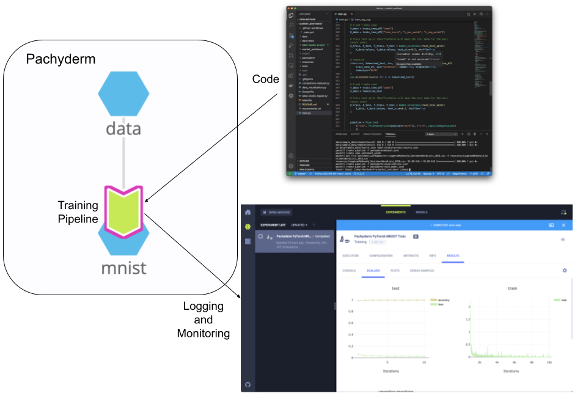

# Pachyderm -> ClearML
Pachyderm logging to ClearML. ClearML is a great visualization and reporting framework for machine learning models, but one of the difficulties is keeping up with changing datasets. By using Pachyderm as our execution platform, we can version our executions, code, data, and models while still tracking everything in ClearML. 

  

This is a simple integration example where we use ClearML for monitoring our jobs and experiments, while using Pachyderm to manage our data and automatically run pipelines when our code or data changes.

## TLDR; How it works

1. [Spin up Pachyderm](https://docs.pachyderm.com/latest/getting_started/local_installation/) Use minikube or cloud deployment and connect to it.
2. [Spin up ClearML](https://app.community.clear.ml) (Using ClearML Hosted Community Edition)
3. [Create a ClearML config](https://allegro.ai/clearml/docs/docs/deploying_clearml/clearml_config_for_clearml_server.html#configuring-clearml-for-your-clearml-server).
4. Copy the access credentials' `CLEARML_API_ACCESS_KEY` and `CLEARML_API_SECRET_KEY` into the `secrets.json` file. We'll use this file to make a [Pachyderm secret](https://docs.pachyderm.com/latest/reference/pachctl/pachctl_create_secret/). This keeps our access keys from being built into our container or put in plaintext somewhere.
5. Create the secret with `pachctl create secret -f secrets.json`
6. Run `make all` to create a data repository and the pipeline. 

Note: Downloading the data locally and then pushing it to Pachyderm may seem counterintuitive at first. Downloading the data locally and then pushing it to a remote cluster seems like an extra step, especially when dealing with a standard dataset like MNIST. However, if we think about a real world use case where multiple teams may be manipulating the data (removing examples, adding classes, etc.) then having a history for each of these models can be very useful. In most production settings with supervised learning, the [labeling environment can be directly connected to the data repository](https://towardsdatascience.com/versioning-and-labeling-better-together-2dd7d4fe8bd9), automating this step.

## MNIST example

- Creates a project in ClearML with the name of the Pachyderm pipeline. 
- Trains an MNIST classifier in a Pachyderm Job
- Logs training info from training to ClearML for monitoring and comparison.
- If the Data or Pachyderm Pipeline changes, it kicks off a new training process.

## Future Goals

- Create a more robust example than MNIST.
- Multi-GPU - ClearML has some really cool features here, but right now Pachyderm is executing the job in a single Pod. 
- Consistent naming of runs between Pachyderm and ClearML - we would ideally like to have the jobs use the same hash ID. 
- Add commit or branch information to the model referenced by ClearML
